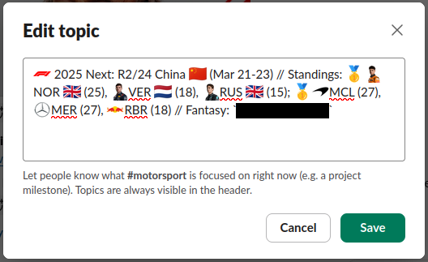

# just-vibes-f1-slack-topic

A script that generates a Slack-compatible F1 topic based on current F1 calendar and championship results.

> [!WARNING] This codebase is almost entirely **AI generated**
> 
> This was a _"vibe coding"_ experiment using `claude-3.7-sonnet` with thinking, and is definitely full of garbage.
> It should **NOT** be used as a reference and I have [licensed it as such](#license) because nobody should legally be allowed to adapt this code.

It might actually work though...? Feel free to try _using_ the tool. No guarantees.



# Vibed readme contents

<details>
<summary>Vibed readme contents</summary>

## Usage

### Installation

```bash
go install github.com/bbrks/just-vibes-f1-slack-topic@latest
```

### Command Line Options

```
just-vibes-f1-slack-topic [options]
```

Available options:

| Flag | Description |
|------|-------------|
| `-detailed` | Show detailed output with full race and standings information (default) |
| `-slack` | Format output as a compact Slack topic that fits within character limits |
| `-quiet` | Suppress log messages |

### Examples

Show detailed F1 information:
```bash
just-vibes-f1-slack-topic
```

Generate a Slack-friendly topic:
```bash
just-vibes-f1-slack-topic -slack
```

Generate a Slack topic with no logging:
```bash
just-vibes-f1-slack-topic -slack -quiet
```
</details>

# LICENSE CC BY-NC-ND 4.0

> ![NOTE]
> This means you're _probably_ not legally allowed to do what you want! This is by design. See the warning.

<p xmlns:cc="http://creativecommons.org/ns#" >This work is licensed under <a href="https://creativecommons.org/licenses/by-nc-nd/4.0/?ref=chooser-v1" target="_blank" rel="license noopener noreferrer" style="display:inline-block;">Creative Commons Attribution-NonCommercial-NoDerivatives 4.0 International</a></p>
